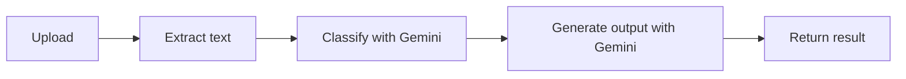

# Smart Document Analyser

Upload a document, and it's automatically classified by type (lecture notes, financial report, meeting notes, or research article) and turned into the output that type needs — flashcards for lecture notes, a summary with key takeaways for reports and meeting notes.

Built as a portfolio project to practise working with a real, structured LLM pipeline rather than a single prompt-and-response chatbot.

## How it works

1. **Upload** — a `.txt`, `.pdf`, or `.docx` file is sent to the API.
2. **Extract** — the file's raw bytes are converted to plain text, using a different method per format (PDF and DOCX need dedicated parsers, since neither is plain text under the hood).
3. **Classify** — the extracted text is sent to Gemini, which returns a document type and a confidence score, constrained to a fixed set of categories via a JSON Schema.
4. **Generate** — based on the classified type, a second Gemini call produces the matching output (flashcards or a summary), again constrained to a specific JSON shape.

## Tech stack

- **Backend:** Python, FastAPI
- **LLM:** Google Gemini (`gemini-3.6-flash`), via the official `google-genai` SDK, using the Interactions API with structured JSON output
- **File parsing:** `pypdf` (PDF), `python-docx` (Word)
- **Planned next:** SQLite + SQLAlchemy for persistence (saving documents, classifications, and generated outputs instead of only returning them in the response)

## Project structure

    app/
      main.py            FastAPI app and the /documents endpoint
      extraction.py      Converts uploaded file bytes into plain text
      classification.py  Classifies document type via Gemini
      generation.py      Generates flashcards/summary via Gemini
      config.py          Loads the Gemini API key from .env
    docs/
      design.md          Epic, personas, scenario, user stories, architecture, data model
      priorities.md      Feature list in MoSCoW order (must/should/could/won't have)

## Running it locally

Clone the repo and set up a virtual environment:

    git clone https://github.com/janagadelmola/SmartDocumentAnalyser.git
    cd SmartDocumentAnalyser
    python -m venv .venv
    .venv\Scripts\Activate.ps1      (Windows)
    pip install -r requirements.txt

Create a `.env` file in the project root with a Gemini API key from [Google AI Studio](https://aistudio.google.com/apikey):

    GEMINI_API_KEY=your-key-here

Then start the server:

    fastapi dev app/main.py

Open `http://127.0.0.1:8000/docs` for the interactive API docs, where you can upload a file and try it directly.

## API

**`POST /documents`** — upload a file (`.txt`, `.pdf`, or `.docx`, max 5 MB)

Returns a JSON object containing the filename, character count, detected `document_type`, a `confidence` score, and an `output` object holding either a `flashcards` list (question/answer pairs) or a `summary` with `key_points`, depending on the document type.

**`GET /health`** — basic status check

## Design decisions worth noting

- **Two separate model calls, not one.** Classification and generation are split, with classification acting as a routing step that decides which generator runs. This keeps each prompt focused and makes it easy to swap in a different generator per type later (e.g. Q&A for research articles).
- **Structured output via JSON Schema**, rather than just asking the model to "reply in JSON" — the response shape is enforced by the API itself.
- **Classification has a fallback**: if Gemini ever returns a type outside the expected five, the code defaults to `other` rather than trusting it blindly.
- **Generation isn't length-capped** — flashcard count and summary length scale with the document's actual content, rather than a fixed range that pads short documents or cuts off long ones.
- Built against a live, changing API: the Gemini SDK moved from `generate_content` to the newer Interactions API partway through development, which meant debugging real breaking changes from the actual error responses rather than from stable documentation.

## Status

This project follows a MoSCoW-prioritised build (see `docs/priorities.md`). Currently working: upload, extraction (`.txt`/`.pdf`/`.docx`), classification, and generation (flashcards/summary). Not yet built: the web frontend, persistence (database), and user accounts.

## License

MIT
