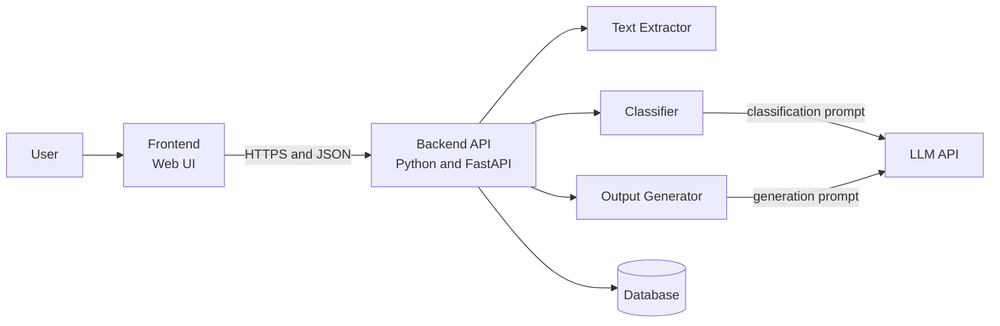
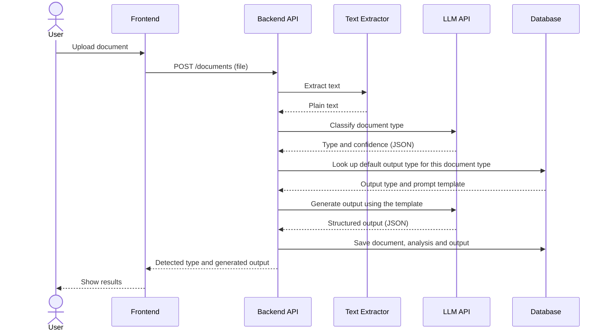
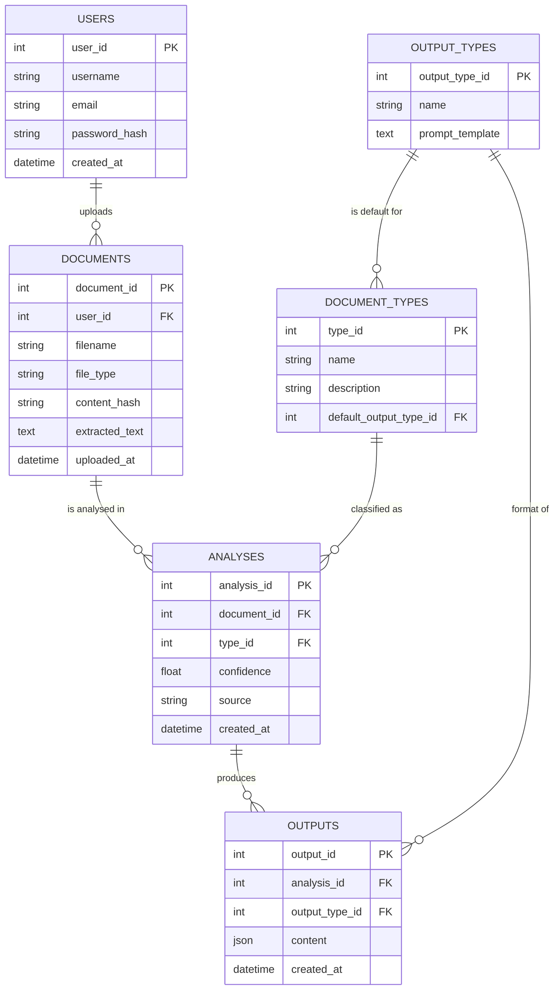

# Smart Document Analyzer: Design Document

This document covers the narrative design (epic, personas, scenario, user stories) and the architecture and data model for the Smart Document Analyzer.

---

# Part 1: Narrative Design

## Epic

As a person who deals with many different kinds of documents, I want to upload a document and have it automatically identified and turned into the output that suits that type (flashcards, a summary, or Q&A) so that I can understand and use its content quickly without deciding how to process it or writing prompts myself.

## Personas

<!-- Add a photo or avatar for each persona, e.g. from avataaars.com, and reference it below with  -->

**Priya**

Priya, age 20, is a second-year Biology student at a UK university. She takes six modules, and every week her lecturers post long sets of lecture notes as PDFs. She learns best by testing herself, so she makes flashcards from her notes, but each set takes her hours to write by hand, and that time often comes out of the time she has left to revise.

She has tried general AI chat tools before, but she never knows what to type to get useful flashcards, and the results change every time. She wants something that simply works: upload the notes and get a set she can start revising from straight away. She also wants to check the cards before she trusts them, because a wrong flashcard is worse than no flashcard.

- **Age:** 20
- **Occupation:** Second-year Biology student, UK
- **Bio:** Studies six modules, learns through self-testing, short on revision time before exams.
- **Goals:**
    - Turn lecture notes into flashcards in minutes instead of hours.
    - Get consistent, well-structured output without writing prompts.
    - Review and correct generated content before revising from it.
- **Frustrations:**
    - Making flashcards by hand takes too long.
    - General AI chat tools need careful prompting and give inconsistent results.
    - Cannot easily tell whether an AI-generated answer is accurate.

**Daniel**

Daniel, age 34, is an operations analyst at a mid-sized logistics company. Each week he receives quarterly financial reports, long meeting notes and supplier documents in a mix of PDF, Word and plain text. Most of his day is spent in meetings, so he often has only a few minutes to work out what a document says and whether it needs action.

He needs to get to the key figures and decisions quickly, and he needs the output to be in a predictable format that he can paste into an email. Because some of his documents are commercially sensitive, he also cares about what happens to files after he uploads them.

- **Age:** 34
- **Occupation:** Operations analyst, logistics company
- **Bio:** Meeting-heavy schedule, handles reports and notes in several file formats, needs quick and reliable summaries.
- **Goals:**
    - Understand a long report in a few minutes.
    - Get key figures and decisions in a consistent format.
    - Stay in control of the documents he uploads.
- **Frustrations:**
    - Long documents in different formats take too long to read.
    - Has to decide how to summarise each document type himself.
    - Unsure how uploaded documents are stored or used.

## Scenario

Priya has a Physiology exam in three days and has just downloaded 40 pages of lecture notes as a PDF. She would normally spend the evening writing flashcards, but instead she opens the Smart Document Analyzer and uploads the file.

The app extracts the text and tells her it has detected a document of type "Lecture notes". Because lecture notes are best revised through self-testing, it generates a set of flashcards. Priya reads through them, edits one card where the wording is unclear, and saves the set. The next day she opens the app on her phone, finds the same set in her history, and revises from it on the bus.

A week later she uploads a document that is a mix of notes and a reading list, and the app labels it wrongly as a research article. She changes the type to "Lecture notes" and regenerates, and this time she gets the flashcards she wanted.

## User Stories

1. As a student, I want the app to detect automatically what type of document I have uploaded, so that I do not have to choose settings or write prompts myself.

2. As a student revising for exams, I want my lecture notes turned into flashcards that I can review, so that I do not spend hours making them by hand.

3. As a busy analyst, I want a short summary of a long report that includes the key figures and decisions, so that I can understand it in minutes.

4. As a user, I want to change the detected document type and regenerate the output, so that I can fix mistakes when the app classifies my document wrongly.

5. As a returning user, I want to see my previous documents and outputs and delete any I no longer need, so that I can revisit my material and stay in control of my data.

---

# Part 2: Architecture and Data Model

## 1. System Architecture

The Smart Document Analyzer is a three-tier application. It consists of a frontend that manages the user interface, a backend that manages the application logic and calls to a language model, and a relational database that stores persistent data.

The frontend lets users register and log in, upload a document, see the detected document type, view and edit the generated output, and browse or delete their previous documents. It never talks to the database or the language model directly. Every action goes through the backend API.

The backend is the core processing layer. When a document is uploaded it passes through four steps:

1. **Text extraction:** the text is pulled out of the file (PDF, DOCX or TXT).
2. **Classification:** the text is sent to the language model with a prompt that asks it to identify the document type and return its answer as JSON along with a confidence score.
3. **Rule lookup:** the backend looks up which output type is the default for that document type (for example, lecture notes produce flashcards, financial reports produce a summary).
4. **Generation:** the backend fills in the prompt template for that output type, sends it to the language model, checks that the reply is valid JSON in the expected shape, and saves it.

The database layer stores users, documents, the analysis of each document, and the generated outputs. The mapping from document type to output type and the prompt templates are stored as data rather than hard-coded, so new document types can be added without rewriting the backend.

The default mapping from document type to output type is:

| Document type | Default output | Reason |
|---|---|---|
| Lecture notes | Flashcards | Best used for self-testing and revision |
| Financial report | Summary | Readers need key figures and conclusions fast |
| Meeting notes | Summary | Readers need decisions and action points |
| Research article | Q&A | Readers need to test their understanding of the main claims |
| Other | Summary | Safe general-purpose fallback |

## 2. UML Diagram

The sequence diagram shows what happens when a user uploads a document.

## 3. Data Model

**Tables**

- **USERS:** stores registered users with a username, email and hashed password (never the plain password), so that documents and outputs belong to individual accounts.
- **DOCUMENTS:** stores each uploaded file's name, format, extracted text and a hash of its content. The hash lets the app recognise a document that has already been analysed.
- **DOCUMENT_TYPES:** a lookup table of the types the classifier can choose from. Each type points to its default output type.
- **OUTPUT_TYPES:** a lookup table of the outputs the app can generate (flashcards, summary, Q&A), each with the prompt template used to generate it.
- **ANALYSES:** records the type a document was classified as, and how confident the model was. The `source` column is either `model` or `user`, so when a user overrides the type a new analysis row is created and the history is kept.
- **OUTPUTS:** stores the generated result for an analysis. The `content` column is JSON, because the shape differs by output type (a list of question and answer pairs for flashcards, sections for a summary).

**How the tables work together**

When a user uploads a file, a row is added to DOCUMENTS. The classifier's result is saved as a row in ANALYSES that points to a row in DOCUMENT_TYPES. The backend follows that type's `default_output_type_id` to OUTPUT_TYPES to find the prompt template, generates the result, and saves it in OUTPUTS. If the user changes the type, a new ANALYSES row with `source = user` is created and a new output is generated from it.

## 4. Design Decisions

**Three-tier architecture.** Keeping the interface, API and database separate means the language model API key and the database are never exposed to the user's browser. It also means the frontend can be replaced later (for example with a React app) without changing the backend, because they only communicate through the API.

**Request and response pattern.** The frontend sends a request and the backend returns a response. This is simple to build and test. If long documents turn out to be too slow for a single request, the design can move to a background job with a status endpoint.

**Two model calls instead of one.** Classification and generation are separate steps. This makes each step easier to test on its own, lets the user override the type without re-uploading, and means the classification call can use a shorter prompt (and so costs less) than the generation call.

**Rules stored as data.** Because the mapping from document type to output type and the prompt templates live in the database, adding a new document type is a data change rather than a code change.

**Structured output that is validated.** The model is asked to reply in JSON and the backend checks the reply against the expected shape before saving. If the reply is invalid the backend can retry once instead of showing broken output to the user.

**Confidence and override.** The classifier can be wrong. The app shows the detected type with its confidence and lets the user change it. If confidence is very low the app falls back to type "Other" and a general summary.

**Relational database with an ORM.** Users, documents, analyses and outputs have clear one-to-many relationships, which suit a relational database. SQLite is used during development because it needs no setup, and using an ORM (SQLAlchemy) means the project can move to PostgreSQL for deployment without rewriting the queries.

**Secrets kept out of the repository.** The language model API key is stored in an environment variable and the file that holds it is listed in `.gitignore`, so it is never committed to GitHub.

## 5. Legal, Sustainability and Ethical Considerations

**Legal.** The app processes text that users upload, and some of it may be personal or commercially sensitive. In the UK this falls under UK GDPR and the Data Protection Act 2018, so the app should collect only what it needs, tell users that their document text is sent to a third-party language model provider, and let users delete their documents and outputs at any time. The app should also state clearly that confidential company documents should not be uploaded to the prototype. Any libraries used must have licences that allow the project's use, and the project's own licence (MIT) should be included in the repository.

**Ethical.** Language models can produce confident but incorrect content, so all output is labelled as AI-generated and the user can edit it before relying on it. The app is intended as a study and productivity aid, and should not be presented as a replacement for reading source material. Documents and outputs belong to the user and are visible only to their account.

**Sustainability.** Each model call uses energy and costs money, so the app avoids unnecessary calls. It uses the content hash to reuse an existing analysis when the same document is uploaded again, uses a shorter prompt for classification than for generation, and limits the size of uploaded files.
